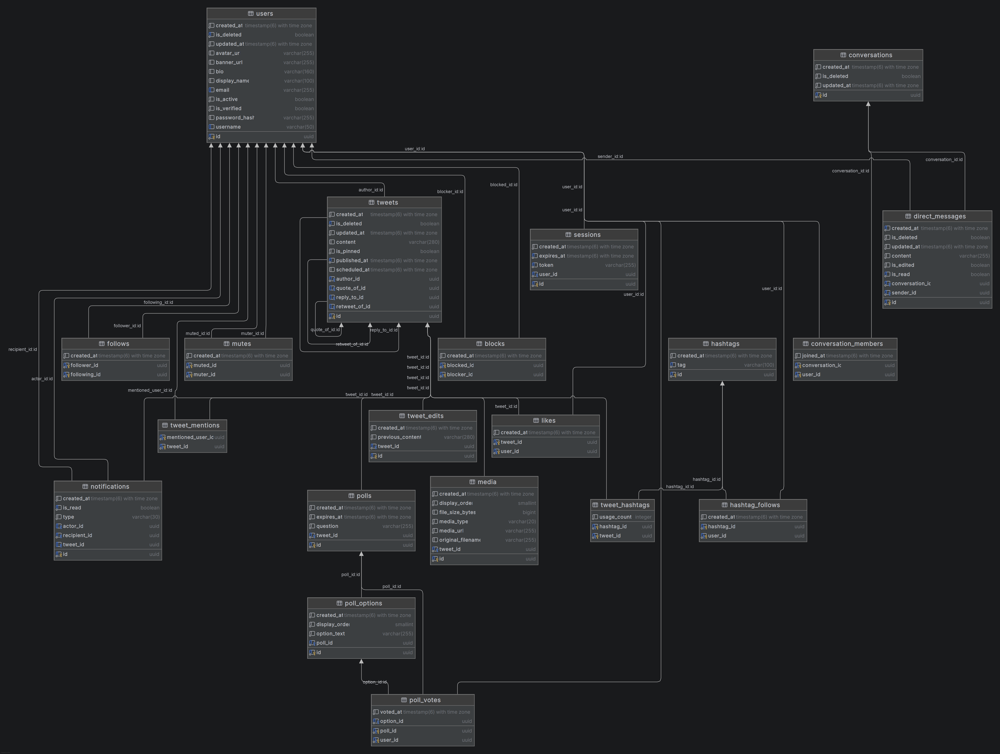
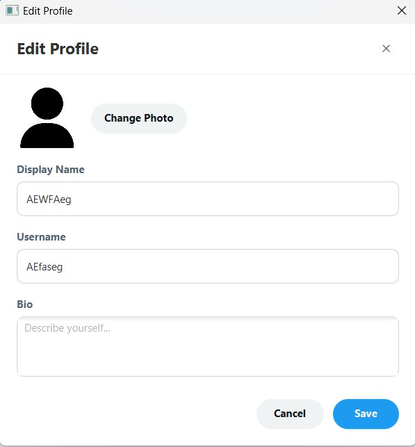
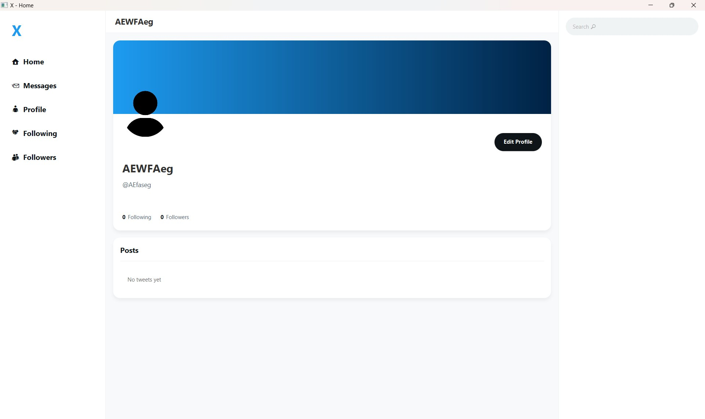
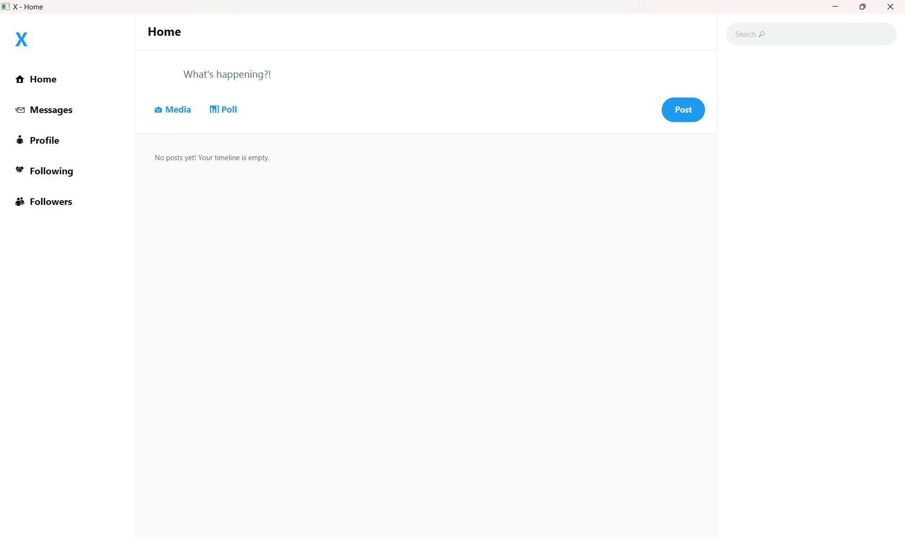
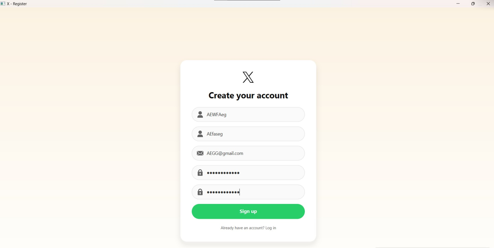
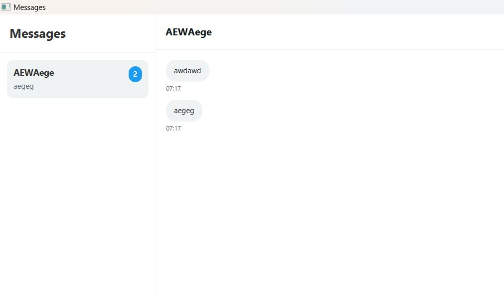

# X-Clone

<p align="center">
  
</p>

<p align="center">
  <b>A client–server social networking desktop application inspired by X (formerly Twitter).</b><br/>
  Built in Java with a JavaFX client, a multithreaded TCP socket server, and a PostgreSQL-backed
  persistence layer built around a layered architecture.
</p>

<p align="center">
  
  
  
  
  
  
  
  
</p>

---

## Table of Contents

1. [Overview](#1-overview)
2. [Features](#2-features)
3. [Architecture](#3-architecture)
4. [Tech Stack](#4-tech-stack)
5. [Project Structure](#5-project-structure)
6. [Getting Started](#6-getting-started)
7. [Running the Application](#7-running-the-application)
8. [Usage Guide](#8-usage-guide)
9. [Demo](#9-demo)
10. [Credits](#10-credits)
11. [Changelog](#11-changelog)
12. [Contact](#12-contact)

---

## 1. Overview

**X-Clone** is a desktop reproduction of the core X/Twitter experience, originally developed as the
final project for the *Advanced Programming* course (Summer 2026).

The application consists of a JavaFX desktop client communicating with a central server over raw
TCP sockets. The server manages authentication, social interactions, tweets, media, polls,
messages, notifications, and other application state backed by PostgreSQL through a
Hibernate/JPA persistence layer.

The current codebase represents **V2**, an ongoing architectural modernization of the original
V1 project.

The project emphasizes:

* A real **client–server architecture** using a hand-rolled JSON communication protocol over
  raw TCP sockets.
* A **layered backend architecture** separating application, domain, and infrastructure concerns.
* A **use-case-driven application layer** with explicit business operations.
* A **repository adapter architecture** that keeps domain repository interfaces independent from
  JPA and persistence details.
* A **normalized relational schema** with soft deletes, composite keys, and indexed relationship
  tables.
* Support for **multiple concurrent clients**, each with its own authenticated server-side session.

## 2. Features

### Implemented

| Category            | Capabilities                                                                                                 |
| ------------------- | ------------------------------------------------------------------------------------------------------------ |
| **Authentication**  | Registration, login/logout, session refresh, BCrypt password hashing, forgot-password / OTP-based reset flow |
| **Profile**         | Profile viewing/editing, avatar & cover image updates, username/email/password changes, account deactivation |
| **Tweets**          | Create, edit (with edit history), soft-delete, reply, quote, retweet                                         |
| **Timeline**        | Home timeline with projection-based, paginated queries                                                       |
| **Interactions**    | Like / unlike, with aggregated like counts                                                                   |
| **Relationships**   | Follow / unfollow, block / unblock, mute / unmute                                                            |
| **Hashtags**        | Automatic extraction, hashtag following, trending hashtags, hashtag search                                   |
| **Search**          | User, tweet, hashtag, media, and conversation search                                                         |
| **Polls**           | Poll creation, voting, and closing                                                                           |
| **Direct Messages** | Conversations with multiple members, sending/editing/deleting messages                                       |
| **Notifications**   | Notification generation, read/unread state, bulk read                                                        |
| **Media**           | Upload, download, and deletion of tweet attachments                                                          |
| **Concurrency**     | Thread-per-client socket handling, isolated session contexts, server-side connection pooling                 |

## 3. Architecture

The current **V2** backend follows a layered architecture that is independent of the JavaFX
client.

```text
                     ┌────────────────────────────┐
                     │           Client           │
                     │  JavaFX views + FXML       │
                     │  Client services + context │
                     └─────────────┬──────────────┘
                                   │
                                   │ JSON over TCP
                                   ▼
                     ┌────────────────────────────┐
                     │         Transport          │
                     │  SocketServer              │
                     │  ClientHandler             │
                     │  RequestDispatcher         │
                     └─────────────┬──────────────┘
                                   │
                                   ▼
        ┌─────────────────────────────────────────────────────────┐
        │                       logic_core                        │
        │                                                         │
        │  application  → Facades, Use Cases, DTOs,               │
        │                  Validators, Mappers, Policies          │
        │                                                         │
        │  domain       → Models, Repository interfaces,          │
        │                  Policies, Domain services              │
        │                                                         │
        │  infrastructure → Repository adapters, Spring Data JPA, │
        │                    Entities, Transport, Configuration   │
        └──────────────────────────┬──────────────────────────────┘
                                   │
                                   │ Spring Data JPA / Hibernate
                                   ▼
                     ┌────────────────────────────┐
                     │         PostgreSQL         │
                     └────────────────────────────┘
```

### V1 → V2

The current V2 architecture is the result of a migration and modernization of the original V1
codebase.

| Area                         | V1                                         | V2                                                      |
| ---------------------------- | ------------------------------------------ | ------------------------------------------------------- |
| **Dependency Management**    | Legacy/manual wiring                       | Spring Dependency Injection                             |
| **Application Architecture** | Legacy layered structure                   | Explicit application, domain, and infrastructure layers |
| **Persistence**              | Legacy DAO/shared persistence architecture | Spring Data JPA + repository adapters                   |
| **Repositories**             | Legacy persistence implementations         | Domain repository interfaces + infrastructure adapters  |
| **JPA Entities**             | Shared persistence/domain infrastructure   | Infrastructure-layer JPA entities                       |
| **Server Wiring**            | Manual dependency construction             | Spring-managed backend components                       |
| **Transport**                | Raw TCP sockets                            | Raw TCP sockets, preserved in V2                        |
| **Client**                   | JavaFX                                     | JavaFX, preserved in V2                                 |
| **Schema Management**        | Legacy persistence setup                   | Flyway-enabled Spring Boot configuration                |
| **Event Infrastructure**     | Event-bus architecture                     | Removed; no active event infrastructure                 |
| **Client Persistence**       | Local SQLite cache                         | No client-side persistence/cache                        |

### V2 Architectural Principles

Key patterns applied throughout the current codebase:

* **Repository pattern** — domain repositories (`UserRepository`, `TweetRepository`,
  `RelationshipRepository`, …) are pure interfaces in `logic_core.domain.repository`;
  infrastructure adapters bridge them to Spring Data JPA repositories and JPA entities.
* **Repository adapter architecture** — persistence concerns remain in the infrastructure layer,
  while application and domain code depend on repository abstractions.
* **Use-case-driven design** — business operations are represented by dedicated classes such as
  `CreateTweetUseCase`, `LoginUserUseCase`, `FollowUserUseCase`, and `GetTimelineUseCase`.
* **Facade layer** — facades such as `TweetFacade`, `AuthFacade`, and `RelationFacade` compose
  use cases for the transport layer.
* **Policy layer** — authorization and business policies are isolated from use cases.
* **Result wrapper** — a unified `Result<T>` (`Success` / `Failure`) is used for expected
  application outcomes.
* **JPQL projections** — dedicated projection DTOs such as `TimelineTweetProjection` avoid
  loading unnecessary entity graphs for read-heavy timeline queries.
* **Soft delete** — entities support soft-delete semantics where required by the domain.
* **Spring-based wiring** — the backend uses Spring Boot dependency injection, Spring Data JPA,
  Hibernate, and Flyway-enabled database configuration.

## 4. Tech Stack

| Concern               | Technology                            |
| --------------------- | ------------------------------------- |
| Language              | Java 25                               |
| Build tool            | Maven                                 |
| GUI                   | JavaFX 26 (FXML + CSS)                |
| Server transport      | Raw TCP sockets, thread-per-client    |
| Serialization         | Gson (JSON)                           |
| Database              | PostgreSQL                            |
| ORM                   | Hibernate / Jakarta Persistence (JPA) |
| Connection pooling    | Spring Boot datasource / HikariCP     |
| Schema management     | Flyway                                |
| Password hashing      | jBCrypt                               |
| Boilerplate reduction | Lombok                                |
| Testing               | JUnit 5, Mockito, Spring Boot Test    |
| Logging               | SLF4J                                 |

## 5. Project Structure

```text
X-Clone/
├── src/main/java/
│   ├── Client/                     JavaFX application, controllers, client services, transport
│   ├── com/xclone/                 Spring Boot application entry point
│   ├── logic_core/
│   │   ├── app/                   Use cases, facades, DTOs, validators, mappers, security
│   │   ├── common/                Exceptions, Result wrapper, utilities, security helpers
│   │   ├── domain/                Domain models, repository interfaces, policies, services
│   │   ├── infrastructure/         Repository adapters, JPA repositories, entities, transport,
│   │   │                            configuration, mappers
│   │   └── session/               Server-side session management
│   └── enums/                     Shared enumerations
├── src/main/resources/
│   ├── Client/fxml/               FXML view definitions
│   ├── Client/css/                Application stylesheet
│   ├── Client/images/             Icons and static assets
│   ├── application.yml            Server configuration
│   └── application-local.yml      Local development overrides
├── src/test/java/Testing/         Unit, integration, and concurrency tests
└── pom.xml
```

## 6. Getting Started

### Prerequisites

* **JDK 25** or later
* **Maven 3.9+**
* **PostgreSQL 14+** running locally or reachable over the network
* A JavaFX-capable desktop environment (Windows, macOS, or Linux)

### Database setup

Create the target database before first launch:

```sql
CREATE DATABASE xclonedb;
```

Connection settings are configured in `src/main/resources/application.yml`.

The project uses Spring Data JPA with Hibernate and Flyway-enabled database configuration.
The default configuration expects PostgreSQL to already contain the application schema.

For local development, `src/main/resources/application-local.yml` may provide local overrides,
including development-specific JPA settings and database credentials.

### Clone & build

```bash
git clone https://github.com/Triple-Force/X-Clone
cd X-Clone
mvn clean compile
```

## 7. Running the Application

The project consists of a Spring Boot backend with a raw TCP socket transport and one or more
JavaFX clients.

Start the server first, then start one or more clients.

### 1. Start the server

The Spring Boot application entry point is:

```text
com.xclone.Application
```

Start the backend with:

```bash
mvn spring-boot:run
```

The socket transport is hosted by the server-side transport layer.

The socket port is configurable through application configuration and defaults to `8888`.

If the chosen port is already in use, free it first.

On Windows:

```bash
netstat -ano | findstr :8888
taskkill /PID <pid> /F
```

On macOS/Linux:

```bash
lsof -i :8888
kill -9 <pid>
```

### 2. Start one or more clients

In a separate terminal:

```bash
mvn -q compile javafx:run
```

Repeat this command in additional terminals to simulate multiple concurrent users.

## 8. Usage Guide

1. **Register** a new account from the client's registration screen (unique username, email,
   and password).
2. **Log in** to establish a session with the server.
3. **Compose a tweet** from the timeline view; hashtags and mentions are detected automatically.
4. **Follow other users** to populate your personalized home timeline.
5. **Interact** with tweets via like, reply, retweet, or quote.
6. **Message** other users through the conversations panel.
7. **Search** for users, tweets, or hashtags using the search bar.
8. **Manage your profile** — update your bio, avatar, cover image, username, email, or
   password from the profile screen.

## 9. Demo








## 10. Credits

### V1 — Original Project

The original V1 project was developed by:

* [**Mohammadreza Ashrafian**](https://github.com/mohammadrezaashrafian)
* [**Alireza Heydari**](https://github.com/AlirezaHeydari-Dev)
* [**Amir Mohammad Talaei**](https://github.com/amirmt86)

### V2 — Current Development

V2 is currently developed and maintained independently by:

* [**Mohammadreza Ashrafian**](https://github.com/mohammadrezaashrafian)

V2 represents the ongoing architectural modernization and independent development of the
original V1 codebase.

## 11. Changelog

| Version | Notes                                                                                                                                                                                                                                                                          |
| ------- | ------------------------------------------------------------------------------------------------------------------------------------------------------------------------------------------------------------------------------------------------------------------------------ |
| **V1**  | Original client–server architecture developed as the Advanced Programming final project, including authentication, tweets, timeline, social graph, hashtags, polls, direct messaging, and notifications.                                                                       |
| **V2**  | Ongoing independent development by **Alireza Heydari**. Migrated the backend to Spring Boot and Spring Data JPA, introduced Spring dependency injection and repository adapters, modernized the persistence architecture, and removed the legacy server/shared infrastructure. |

## 12. Contact

For questions about this project, please reach out via the team's GitHub organization
repository issues page.
